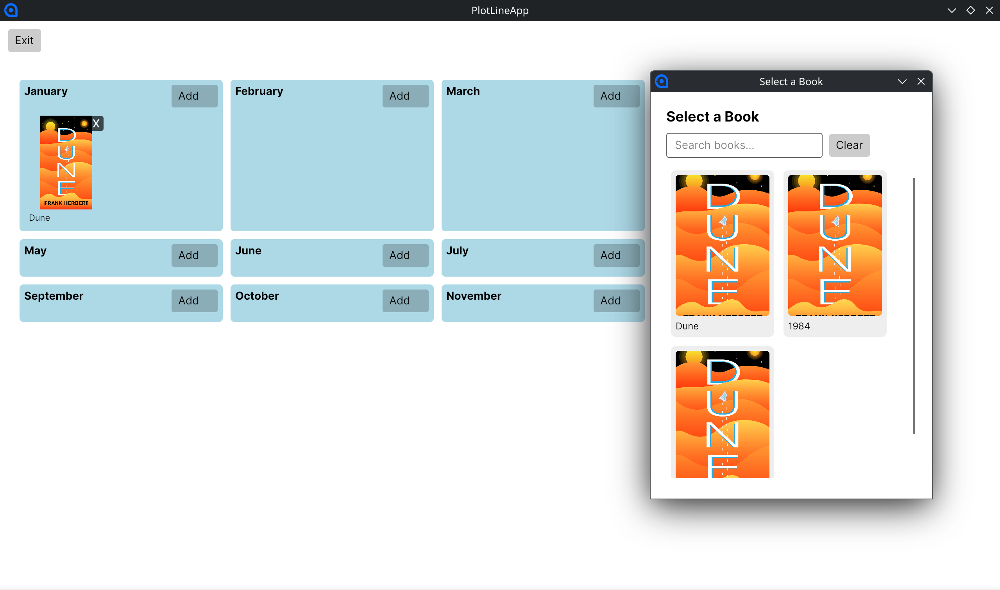

# Plotline
Plan your reading year visually.

## Current Prototype

## How to Run
Use the helper script to build, run, and test.

- View options: `./mkr.sh`
- Run the app: `./mkr.sh run`
- Run tests: `./mkr.sh test -c Debug`
- Build Release: `./mkr.sh build -c Release`
- Clean: `./mkr.sh clean`

## Dependencies
- .NET SDK 9.0+
- Avalonia (restored via NuGet)

## License
See `LICENSE`.
